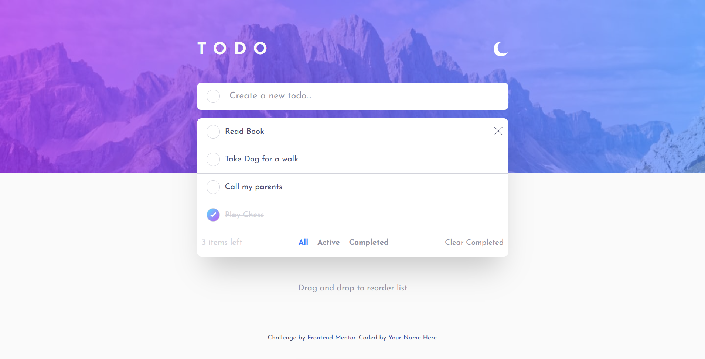

# Frontend Mentor - Todo app solution

This is a solution to the [Todo app challenge on Frontend Mentor](https://www.frontendmentor.io/challenges/todo-app-Su1_KokOW). Frontend Mentor challenges help you improve your coding skills by building realistic projects. 

## Table of contents

- [Overview](#overview)
  - [The challenge](#the-challenge)
  - [Screenshot](#screenshot)
  - [Links](#links)
- [My process](#my-process)
  - [Built with](#built-with)
  - [What I learned](#what-i-learned)
  - [Continued development](#continued-development)
- [Author](#author)

## Overview

### The challenge

Users should be able to:

- View the optimal layout for the app depending on their device's screen size.
- See hover states for all interactive elements on the page.
- Add new todos to the list.
- Mark todos as complete.
- Delete todos from the list.
- Filter by all/active/complete todos.
- Clear all completed todos.
- Toggle light and dark mode.
- **Bonus**: Drag and drop to reorder items on the list.
- **Custom Feature**: Smooth "fall-out" height animations when deleting tasks.
- **Custom Feature**: Toast notification with an **Undo** button to restore deleted items.
- **Custom Feature**: Persistent data and theme settings via LocalStorage.

### Screenshot




### Links

- Solution URL: [https://github.com/mano-coder/Todo-App]
- Live Site URL: [https://mano-coder.github.io/Todo-App/]

## My process

### Built with

- Semantic HTML5 markup
- CSS custom properties (Variables)
- Flexbox
- Mobile-first workflow
- Vanilla JavaScript (ES6+)
- **HTML5 Drag and Drop API** - For reordering tasks.
- **LocalStorage API** - For saving tasks and theme preferences.

### What I learned

This project was a great lesson in managing the Document Object Model (DOM) without a framework. I learned how to handle complex state changes, such as keeping the "Items Left" count and "Filters" in sync when tasks are added or deleted.

I particularly enjoyed implementing the **Drag and Drop** logic. It required calculating the mouse position relative to list items to create a smooth reordering experience:

```js
taskList.addEventListener("dragover", (e) => {
  e.preventDefault(); 
  const draggingItem = document.querySelector(".dragging");
  const siblings = [...taskList.querySelectorAll("li:not(.dragging)")];

  let nextSibling = siblings.find((sibling) => {
    return e.clientY <= sibling.offsetTop + sibling.offsetHeight / 2;
  });

  taskList.insertBefore(draggingItem, nextSibling);
});

I also improved the user experience by adding an **Undo system**. By "capturing" the task data before it was removed from the DOM, I was able to give users a safety net:

JavaScript

```
// Capturing state before deletion
lastDeletedTask = {
  text: li.querySelector("span:not(.checkbox)").innerText,
  completed: li.querySelector(".checkbox").classList.contains("checked")
};

```

### Continued development

In future projects, I plan to:

-   **Refine Animations**: Explore using the Web Animations API for even smoother transitions.

-   **Accessibility**: Improve the drag-and-drop feature to be fully accessible via keyboard (tabbing and arrow keys).

-   **State Management**: Try rebuilding this using a framework like React or Vue to compare how they handle list rendering compared to Vanilla JS.

Author
------

-   Frontend Mentor - [mano-coder's profile | Frontend Mentor](https://www.frontendmentor.io/profile/mano-coder)

